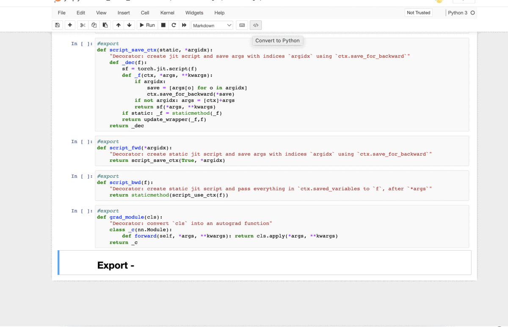

# Ipynb to Python

Extension for converting IPython notebook to Python file for nbdev users. Note that nbdev is required for the conversion to work.

## Demo

## How to use

- Install the Jupyter notebook extensions

`pip install jupyter_contrib_nbextensions`

- Look for the extensions location using

`pip show jupyter_contrib_nbextensions`

- clone the python_gen to the appropriate folder

reference: `/Users/<user_name>/opt/anaconda3/lib/python3.8/site-packages/jupyter_contrib_nbextensions/nbextensions/python_gen`

- Install the extension

`jupyter nbextension install python_gen`

- Enable the extension

`jupyter nbextension enable python_gen/main`